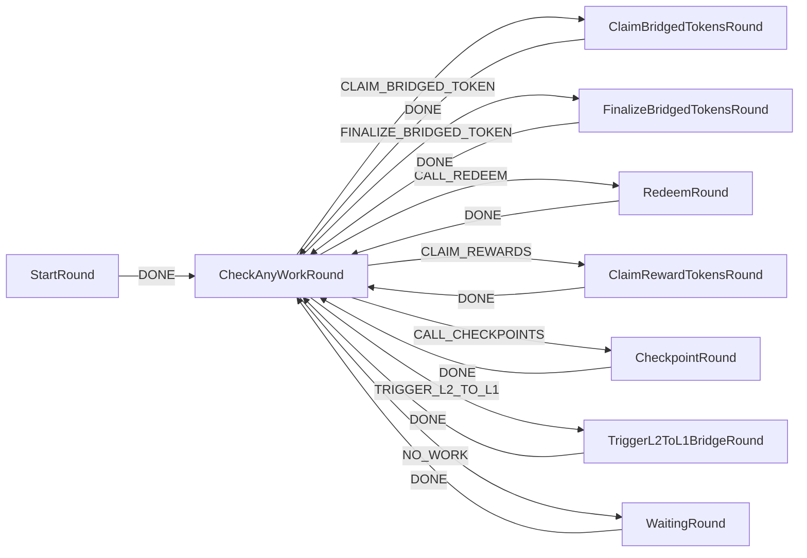

# stOLAS — Agent Workflow

This file provides agent workflow description section. 
---

## Workflow Diagram



---

## Agent Workflow — Step by Step

### Claim Bridged Tokens (L2 -> L1)

Agents are going to interact with relevant L1 bridge contracts in order to finalize fund transfers from L2 to L1.
Each native bridge is specific to its fund transfer finalization times and routines.

#### Gnosis Bridge

In order to finalize token transfer on L1, the [`executeSignatures()`](https://etherscan.io/address/0x4C36d2919e407f0Cc2Ee3c993ccF8ac26d9CE64e#writeProxyContract#F3)
function needs to be called on [AMB (Foreign)](https://docs.gnosischain.com/bridges/About%20Token%20Bridges/amb-bridge#contracts)
contract with the following parameters:
- `_data`: `encodedData` value from `UserRequestForSignature()` event from [AMB (Home)](https://gnosisscan.io/address/0x75Df5AF045d91108662D8080fD1FEFAd6aA0bb59#events) contract;
- `_signatures`: from the return value of [`getSignatures()`](https://gnosisscan.io/address/0x7d94ece17e81355326e3359115D4B02411825EdD#readContract#F2) method.

Read full Gnosis guide of how to call execute signatures [here](https://docs.gnosischain.com/bridges/About%20Token%20Bridges/amb-bridge#how-to-call-executesignatures-on-foreign-amb-ethereum).

#### Base bridge

In order to finalize token transfer on L1, the [`relayMessage()`](https://etherscan.io/address/0x866E82a600A1414e583f7F13623F1aC5d58b0Afa#writeProxyContract#F2)
function needs to be called on [L1CrossDomainMessenger](https://docs.base.org/base-chain/network-information/base-contracts#ethereum-mainnet) contract.
However, there is a script that facilitates a required sequence of calls for bridging assets from L2 to L1.

It is advised to use documentation and workflow provided [here](https://github.com/valory-xyz/l2_withdraws/tree/main?tab=readme-ov-file#base).

### Finalize Bridged Tokens on L1

Once tokens are fully bridged on L1 in their corresponding contracts, the last step is to direct them to designated destinations.
Currently, there are two contracts that require L2-L1 bridged funds forwarding further:
- [Distributor](../contracts/l1/Distributor.sol): call function `distribute()`;
- [UnstakeRelayer](../contracts/l1/UnstakeRelayer.sol): call function `relay()`.

It is advised to check `olas.balanceOf(distributorProxyAddress)` and `olas.balanceOf(unstakeRelayerProxyAddress)` before executing function calls.

### Redeem Operations

There could be scenarios when **STAKE** / **UNSTAKE** / **UNSTAKE_RETIRED** operations are not complete in an automatic way on L2 when triggered on L1.
For example, OLAS funds arrive across bridge later than the message with the instruction about where funds need to be relayed.
In this case, the `RequestQueued()` event in each [DefaultStakingProcessorL2](../contracts/l2/bridging/DefaultStakingProcessorL2.sol)
is emitted with the following variables:

```solidity
enum RequestStatus {
    NON_EXISTENT,
    EXTERNAL_CALL_FAILED,
    INSUFFICIENT_OLAS_BALANCE,
    UNSUPPORTED_OPERATION_TYPE,
    CONTRACT_PAUSED
}

event RequestQueued(bytes32 indexed batchHash, address indexed target, uint256 amount, bytes32 operation, RequestStatus status);
```

In order to complete the queued request, the agent must call the `redeem()` function using values from the `RequestQueued()` event:
```solidity
/// @dev Redeems queued staking deposit / withdraw.
/// @param batchHash Batch hash.
/// @param target Staking target address.
/// @param amount Staking amount.
/// @param operation Funds operation: stake / unstake.
function redeem(bytes32 batchHash, address target, uint256 amount, bytes32 operation) external;
```

It is recommended to get the hash of the redeem operation with the following function:
```solidity
/// @dev Gets failed request queued hash.
/// @param batchHash Batch hash.
/// @param target Staking target address.
/// @param amount Staking amount.
/// @param operation Funds operation: stake / unstake.
function getQueuedHash(bytes32 batchHash, address target, uint256 amount, bytes32 operation) public view returns (bytes32);
```

and check that the redeem is still queued with the following function using the queued hash value:
```solidity
function queuedHashes(bytes32) external view returns (RequestStatus);
```

Note that **STAKE** operations will be redeemed either to finalize the stake, if queued due to insufficient OLAS balance
(`INSUFFICIENT_OLAS_BALANCE`), or to be transferred back to L1 in all other cases.

Queued **UNSTAKE** and **UNSTAKE_RETIRED** operations must be always redeemed, as changes were already recorded on L1.
If for some reason redeem keeps on failing, agents need to continue trying to redeem once in a while, as the failed request
will be identified and the fix will be in place.

Note that `UNSUPPORTED_OPERATION_TYPE` queued status will never be delivered within the current contract scope,
so agents are free to ignore those requests. However, proper separation of events is required.

### Claim Reward Tokens

Each staked service has a controlling [ActivityModule](../contracts/l2/ActivityModule.sol) contract, which serves as an entry point
to all the LST service activity. In order to claim reward tokens and immediately transfer them to [Collector](../contracts/l2/Collector.sol)
contract, agents need to call the `claim()` function, which triggers the `checkpoint()` function call as well of a corresponding `stakingProxy` contract.

Events to track staking proxy addresses, stacked service Ids and their corresponding activity modules in [StakingManager](../contracts/l2/StakingManager.sol) proxy contract:
```solidity
event Staked(address indexed stakingProxy, uint256 indexed serviceId, address activityModule);
event Unstaked(address indexed stakingProxy, uint256 indexed serviceId, address activityModule);
```

Helper function to get all the staked services in [StakingManager](../contracts/l2/StakingManager.sol) proxy contract:
```solidity
/// @dev Gets staked service Ids for a specific staking proxy.
/// @param stakingProxy Staking proxy address.
/// @return serviceIds Set of service Ids.
function getStakedServiceIds(address stakingProxy) external view returns (uint256[] memory serviceIds);
```

Ultimately there is a set of active activity module addresses that must be called by agents to get rewards.

### Staking Proxy Checkpoint

For any of `stakingProxy` address, the `checkpoint()` function can be called at any moment. However, note that the `checkpoint()`
is also called when `stake()`, `claim()` and `ustake()` are called. If applicable, it is advised to monitor the following condition
prior to calling the `checkpoint()` function:
```
if (block.timestamp - stakingProxy.tsCheckpoint() > stakingProxy.livenessPeriod()) {
    send stakingProxy.checkpoint();
}
```

This check is going to skip the `checkpoint()` call if the checkpoint has been already triggered within the `livenessPeriod` time.

### Trigger L2 to L1 Tokens Bridging

Each L2 [Collector](../contracts/l2/Collector.sol) proxy contract collects OLAS from **REWARD** / **UNSTAKE** / **UNSTAKE_RETIRED**
operations that are sent to L1.

The following event is emitted when the Collector is top upped:
```solidity
event OperationReceiverBalancesUpdated(bytes32 indexed operation, address indexed receiver, uint256 balance);
```

At the same time, each corresponding operation balance can be fetched any moment using the following public getter:
```solidity
function mapOperationReceiverBalances(bytes32 operation) external view returns (ReceiverBalance memory);
```

If balances are not smaller than the `Collector.MIN_OLAS_BALANCE()` value, the following function can be triggered by agents:
```solidity
/// @dev Relays tokens to L1.
/// @param operation Operation type related to L1 receiver.
/// @param bridgePayload Bridge payload.
function relayTokens(bytes32 operation, bytes memory bridgePayload) external payable;
```

Here is the values of currently supported operations:
```
// Reward operation
REWARD = "0x0b9821ae606ebc7c79bf3390bdd3dc93e1b4a7cda27aad60646e7b88ff55b001";

// Unstake operation
UNSTAKE = "0x8ca9a95e41b5eece253c93f5b31eed1253aed6b145d8a6e14d913fdf8e732293";

// Unstake-retired operation
UNSTAKE_RETIRED = "0x9065ad15d9673159e4597c86084aff8052550cec93c5a6e44b3f1dba4c8731b3";
```

---
