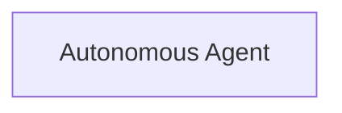

# stOLAS — Agent Workflow

This file provides agent workflow description section. 
---

## Workflow Diagram



---

## Agent Workflow — Step by Step

### Claim Bridged Tokens

Agents are going to interact with relevant L1 bridge contracts in order to finalize fund transfers from L2 to L1.
Each native bridge is specific to its fund transfer finalization times and routines.

### Redeem Stake Operations

There could be scenarios when **STAKE** / **UNSTAKE** operations are not complete in an automatic way on L2 when triggered on L1.
For example, OLAS funds arrive across bridge later than the message with the instruction about where funds need to be relayed.
In this case, the `RequestQueued()` event in each [DefaultStakingProcessorL2](../contracts/l2/bridging/DefaultStakingProcessorL2.sol)
is emitted with the following variables:

```solidity
event RequestQueued(bytes32 indexed queueHash, address indexed target, uint256 amount, bytes32 indexed batchHash, bytes32 operation, uint256 issueType);
```

In order to complete the queued request, the agent must call the `redeem()` function using values from the `RequestQueued()` event:
```solidity
/// @dev Redeems queued staking deposit / withdraw.
/// @param target Staking target address.
/// @param amount Staking amount.
/// @param batchHash Batch hash.
/// @param operation Funds operation: stake / unstake.
function redeem(address target, uint256 amount, bytes32 batchHash, bytes32 operation) external;
```

### Claim Reward Tokens

### Staking Proxy Checkpoint

### Trigger L2 to L1 Tokens Bridging


---
