# stOLAS — Architecture Diagrams

This file provides two complementary Mermaid diagrams (a **flowchart** and a **sequence diagram**) plus a concise **legend & notes** section. 
---

## Architecture — Interaction Diagram (Flowchart)

```mermaid
flowchart LR
  A[Autonomous Agent]

  subgraph L1 [L1 — Ethereum]
    Timelock@{ shape: div-rect, label: "Timelock" }
    U[User]
    D[Depository]
    V[stOLAS]
    VEO[veOLAS]
    T[Treasury]
    Dist[Distributor]
    UR[UnstakeRelayer]
    BP1[Deposit Processor]
    LZ[LZ Oracle]
  end

  subgraph L2 [L2 — Gnosis, Base]
    SM[StakingManager]
    STL[StakingTokenLocked]
    Coll[Collector]
    Svc[Services]
    AM@{ shape: notch-rect, label: "ActivityModule" }
    BP2[Staking Processor]
  end

  Timelock -->|open, close staking model| D
  U --> LZ
  LZ -->|open, close staking model| D

  %% A) Deposit / Mint
  U -->|deposit OLAS| D
  D -->|deposit / topUp →| V
  D -->|bridge and stake OLAS| BP1
  V -->|mint stOLAS| U
  BP1 ==>|OLAS bridge for stake →| BP2

  %% B) Rewards (REWARD → Distributor)
  SM -->|deploy, terminate| Svc
  Svc -->|rewards accrue| Coll
  SM -->|stake / claim / unstake| STL
  STL -->|stake, claim| Svc
  Coll -->|relay tokens| BP2
  BP2 ==>|OLAS bridge for rewards →| Dist
  Dist -->|top up reserves| V
  Dist -.->|lock| VEO
  A-->|claim|AM
  AM-->|claim|SM
  AM-->|controls|Svc

  %% C) Withdraw & Unstake (UNSTAKE → Treasury)
  U -->|request to withdraw and finalize| T
  BP2 ==>|OLAS bridge for unstake and withdraw →| T
  T -->|redeem up to vault+reserve| V
  STL -->|REWARD, UNSTAKE, UNSTAKE_RETIRED| Coll
  T -->|pay OLAS| U

  %% D) Retired Unstake (UNSTAKE_RETIRED → UnstakeRelayer)
  BP2 ==>|OLAS bridge for permanent unstake →| UR
  UR -->|top up retired balance| V
```

---

## Architecture — Sequence Diagram

> If your local Markdown previewer doesn’t support `box` groups, you can remove the `box ... end` lines; GitHub rendering typically supports modern Mermaid.

---

## Legend & Notes

**L1 components**
- **Depository** — sole caller of `stOLAS.deposit()`; orchestrates staking/rebalancing; uses `topUp*` and `syncStakeBalances` to keep vault accounting aligned.
- **stOLAS Vault (ERC4626)** — maintains internal reserves (`staked/vault/reserve`) and derives **PPS** as `totalReserves / totalSupply`. **Entrypoints are non-standard:** `deposit` only via Depository, `redeem` only via Treasury; `mint/withdraw` are not for external use.
- **Treasury** — records **withdraw requests** (ERC6909 semantics), enforces cooldown and **pays** OLAS on finalization.
- **Distributor** — receives **REWARD** from L2; can lock a portion to **veOLAS** and/or **top up** the vault.
- **UnstakeRelayer** — receives **UNSTAKE_RETIRED** returns and forwards to `stOLAS.topUpRetiredBalance` (does not directly fund Treasury payouts).

**L2 components**
- **StakingManager / StakingTokenLocked** — manage staking lifecycle for services and accrue rewards.
- **Collector** — bridges ops/tokens to L1 with explicit routing for: **REWARD**, **UNSTAKE**, **UNSTAKE_RETIRED**.

**Bridge Processor (L1/L2)** — abstract transport for messages + OLAS between chains.

**Operational requirement (critical)**
- Required mapping on **Collector.setOperationReceivers**:
  - `REWARD → Distributor (L1)`
  - `UNSTAKE → Treasury (L1)`
  - `UNSTAKE_RETIRED → UnstakeRelayer (L1)`
- Add a preflight that reads back receivers and fails deployment on mismatch; monitor `OperationReceiversSet`, `TokensRelayed` (L2) and `WithdrawRequest*` (L1).

**PPS & Accounting**
- `totalReserves = stakedBalance + vaultBalance + reserveBalance`; PPS reflects **internal accounting** (immune to unsolicited token transfers).
- Rewards top-ups increase reserves → PPS growth for all stOLAS holders.

