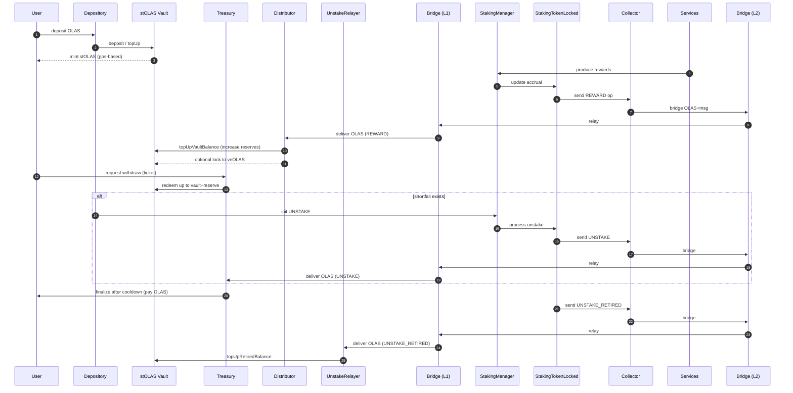

# stOLAS — Architecture Diagrams

This file provides two complementary Mermaid diagrams (a **flowchart** and a **sequence diagram**) plus a concise **legend & notes** section. 
---

## Architecture — Interaction Diagram (Flowchart)

```mermaid
flowchart LR
  subgraph L1 [L1 — Ethereum]
    U[User]
    D[Depository]
    V[stOLAS Vault (ERC4626)]
    T[Treasury<br/>(Withdraw tickets, ERC6909)]
    Dist[Distributor]
    UR[UnstakeRelayer]
    BP1[Bridge Processor (L1)]
  end

  subgraph L2 [L2 — e.g., Gnosis]
    SM[StakingManager]
    STL[StakingTokenLocked]
    Coll[Collector]
    Svc[Services]
    BP2[Bridge Processor (L2)]
  end

  %% A) Deposit / Mint
  U -->|deposit OLAS via app| D
  D -->|deposit / topUp →| V
  V -->|mint stOLAS| U

  %% B) Rewards (REWARD → Distributor)
  Svc -->|rewards accrue| SM
  SM --> STL
  STL -->|REWARD| Coll
  Coll -->|bridge →| BP2 --> BP1 --> Dist
  Dist -->|top up reserves| V
  Dist -.->|optional lock| VEO[Lock / veOLAS]

  %% C) Withdraw & Unstake (UNSTAKE → Treasury)
  U -->|withdraw request| T
  T -->|redeem up to vault+reserve| V
  D -.->|init UNSTAKE| SM
  SM --> STL
  STL -->|UNSTAKE| Coll
  Coll -->|bridge →| BP2 --> BP1 --> T
  U -->|finalize after cooldown| T -->|pay OLAS| U

  %% D) Retired Unstake (UNSTAKE_RETIRED → UnstakeRelayer)
  STL -->|UNSTAKE_RETIRED| Coll
  Coll -->|bridge →| BP2 --> BP1 --> UR
  UR -->|topUpRetiredBalance| V
```

---

## Architecture — Sequence Diagram

> If your local Markdown previewer doesn’t support `box` groups, you can remove the `box ... end` lines; GitHub rendering typically supports modern Mermaid.



---

## Legend & Notes

**L1 components**
- **Depository** — sole caller of `stOLAS.deposit()`; orchestrates staking/rebalancing; uses `topUp*` and `syncStakeBalances` to keep vault accounting aligned.
- **stOLAS Vault (ERC4626)** — maintains internal reserves (`staked/vault/reserve`) and derives **PPS** as `totalReserves / totalSupply`. **Entrypoints are non-standard:** `deposit` only via Depository, `redeem` only via Treasury; `mint/withdraw` are not for external use.
- **Treasury** — records **withdraw tickets** (ERC6909 semantics), enforces cooldown and **pays** OLAS on finalization.
- **Distributor** — receives **REWARD** from L2; can lock a portion to **veOLAS** and/or **top up** the vault.
- **UnstakeRelayer** — receives **UNSTAKE_RETIRED** returns and forwards to `stOLAS.topUpRetiredBalance` (does not directly fund Treasury payouts).

**L2 components**
- **StakingManager / StakingTokenLocked** — manage staking lifecycle for services and accrue rewards.
- **Collector** — bridges ops/tokens to L1 with explicit routing for: **REWARD**, **UNSTAKE**, **UNSTAKE_RETIRED**.

**Bridge Processor (L1/L2)** — abstract transport for messages + OLAS between chains.

**Operational requirement (critical)**
- Required mapping on **Collector.setOperationReceivers**:
  - `REWARD → Distributor (L1)`
  - `UNSTAKE → Treasury (L1)`
  - `UNSTAKE_RETIRED → UnstakeRelayer (L1)`
- Add a preflight that reads back receivers and fails deployment on mismatch; monitor `OperationReceiversSet`, `TokensRelayed` (L2) and `WithdrawRequest*` (L1).

**PPS & Accounting**
- `totalReserves = stakedBalance + vaultBalance + reserveBalance`; PPS reflects **internal accounting** (immune to unsolicited token transfers).
- Rewards top-ups increase reserves → PPS growth for all stOLAS holders.


